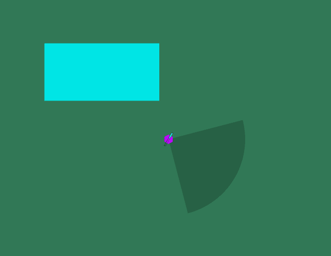
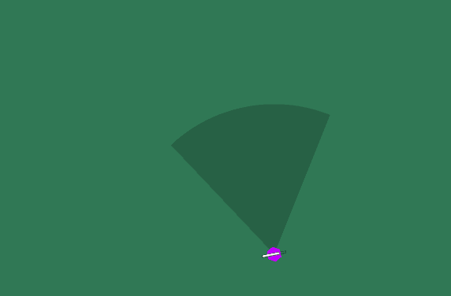
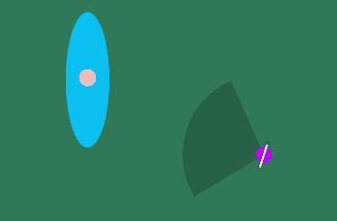
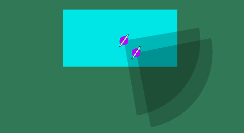
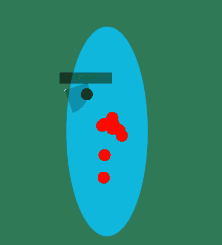
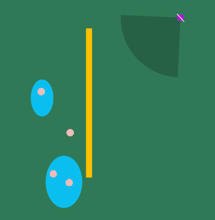
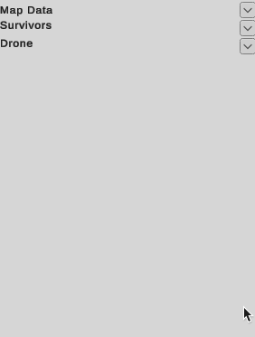

# Drone Rescue System Simulation

**This ReadME file was designed for Github and it is best read on the repo: https://github.com/OPNilsson/Drone-Simulator**

**To get instruction on how to run the code scroll down to [Running the Simulation](#running-the-simulation)**

A program designed for [Model-Based Systems Engineering 02223](https://kurser.dtu.dk/course/02223) at DTU, in where the goal of the course was to implement a program that will present a solution to a client that would ease a task that would be hard to find without the simulator. For this task our group (Group 25), decide to create a simulation of a drone rescue in where people are stranded around in an emergency scenario.

The program features two drone types, a plane (UAV), a quadcopter (Drone), simulated humans that wander (sometimes simulate panic by running), and finally some obstacles that block drone sight and path. These systems are all explained in their own respective sections below.

# Simulation Specifics 

## Drones

The base of the program is the simulation of these drones, all drone types are built upon the following foundations (Described in more detail in the Quadcopters & UAVs subsection):

- Movement
    - Speed
    - Rotation Speed
    - Timescale Multiplier
    - Fuel 
        - Fuel Consumption
    - Collider
        - Waypoint Distance
    - Sprite
- FOV
    - View Radius
    - View Angle
    - Target
- Drone Base
    - Interests
    - Obstacles

#### Movement

To get drones to move the `A* Pathfinding Project Library` in Unity was used this seperates the Unity world space into a x-axis an a y-axis grid where objects can be seperated into layers (native unity) and then certain game objects with the seeker script (part of `A* Pathfinding Project Library`) can utilize the grid to be given a path to their target layer. Seperating game objects into layers isn usefull as they can be implemented into object layers as well.

In order to move Unity force is added to the rigidbody of the drone multiplied by the movement speed of that drone and the timescale. Each time that a force is applied to the drone it uses part of its fuel bar multiplied by the done's fuel consumption. The drone also has a rotation speed which determines how fast the drone redirects to face the direction of desired travel. All these systems can be seen in the movie below.

#### Refuling

A drone has a maximum flight distance as simulated by the usage of the fuel bar on the drones. When movement is conduceted and the drone consumes fuel it will check if it has a minimum fuel capacity required to keep flying, if it doesn't it will attempt to fly back to the [Drone Base](#drone-base). The further that the drone flies away from the drone base the larger the minimum fuel capacity required to keep flying is in an attempt to simulate the drones to have a sense  that they need to have enough fuel to fly back to base.

#### FOV

The Field Of View (reffered to as FOV for the rest of this readme) of a drone consists of two main factors:

- View Radius: the distance from the drone that the drone can spot survivors
- View Angle: How much of the circle around the drone that it can spot survivors

These two systems are highlighted by the following movie in where first the View Angle is demonstrated and then the View Radius.

This grey area is around the drone is the representation of the drone's FOV an shows the area that the survivor can be in order to be spotted by the drone. Once a Human comes into the FOV area a time to find is generated above the survivor and is saved. See the movie below. This is the main goal of the simulation as it is an attempt to maximize the number of survivors spotted with an ideal number of drones, in an attempt to show that drones are a viable solution to emergency response.

### Drone Base

The drone base is a crucial component to the drones as it simiulates the rescu operator giving new intuition to the drones on where to fly in search of survivors. The Drone base controls the reassignment of the drones target, the generation of new [Points of Interest](#points-of-interest), and the refuling of the drones.  

### Points of Interest (aka. Areas of Interest)

The drone base updates the areas where it believes that there are possible survivors around the map. The size of the area depends on how many possible survivors are in that area. These are used for drone navigation as the drones will try to fly to these points of interest and "scout" them by flying from edge to edge.  

### Obstacles

Obstacles are implemented to be generated around the map to block the drones from spotting a survivor on the opposite side or by simply blocking the drone from traversing through it. These were thought by the development team to be potential buildings or trees in the rescue operation area that could occur in the real scenario, however, for the purposes of the simulator do not affect the implementation much as seen in the report.  

## People

People are the focus of the simulation as they require to be inside the drone's fov to be spotted and marked for rescue. When this happens the simulator saves the time required to find the survivor and displays it out to the user. Since the goal of the simulator is to show if drones are a practical implementation for rescue operations humans can act in a chaotic manner "fleeing" from the scene, wandering around, or freezing in place.  

 
# User Interface

The main interface has 2 parts, the map, with it's mini-map, and the UI. The map itself can be navigated with arrow-keys or WASD, using Q and E to zoom in and out respectivly.  

## Dropdown Menu

The UI has a series of categories, each with a dropdown button to extend them shown below:

The dropdown settings affect the following:

- Map Data, where the map size (SX and SY), time scale (Ts), and the control center's position (CCX, CCY) can be set, all in SI units.
    Additionally, two winds can be configured, the primary wind (WSX1, WSY1), and the secondary wind (WSX2, WSY2). A wind duration (WSD) can be set. This duration will determine how long it takes to switch from the primary to the secondary wind, and if zero, will result in a constant primary wind.
    Finally, the button (Update Map) does as it name implies, and starts the simulation.

- Survivors, where the number of survivors (N), the number of PoI (PoIN), and seed (Seed) can be set. These are all positive integers.

- Drone, where the number of drones can be set (DN), and the drone sub-menu can be accessed (Component Selection). Additionally, some stats are given based on the selected components: speed (v), acceleration (a), and battery life (Td). The other statistics are unused, and where initially for turn radius calculation.

- The drone component selection sub-menu is heavily simplified, with only motor and battery selection, both of which have 3 classes of component, (A, B, C) each progressively better. For future work, more concrete components with corresponding calculations of drone statistics would be preferred, but this was more complex than anticipated, and not essential to the simulation.
Pressing (Update Drone) updates the statistics in the main menu, though it's not necessary to press it, as starting the simulation triggers it regardless.

# Running the Simulation

**In order to  test other aspect of the simulation Unity Editor is prefered**

Follow the following steps in order to get the simulation program up and running.

1. Open the project folder inside Unity Editor (or run the exe file and skip to step 4).  
2. Open the Scenes folder and load the Drone Systems scene.
3. Click the green play button at the top of the Unity Editor.
4. Input the simulation parameters on the side of the screen make sure to have atleast 1 POI, Human, and Drone.

To test other parts of the program open one of the other scenes or drag prefabs into the game enviorment to create a new test scenerio.

When a simulation is started, the map will be populated, and survivors will begin to wander, while drones will begin to progressively spawn. The user can follow them with the camera controls if desired, or they can wait for them to finish.
When all people are found, or all PoI are exhausted, a CSV will be generated in the simulator's folder.  

## Input
Using the user interface to setup the simulation press `Update Map`  to start the simulation with the parameters entered. In order to start a new simulation with new parameters simply enter the new parameters and press `Update Map` again.

## Output

The CSV file will include information on coordinates and time where survivors were found. The CSV will be named using the current time, to avoid overwriting results. In our experiments, we primarily used the last survivors time, as an indicator of the time it took to find all survivors, though further insight can be gained from the additional data.

